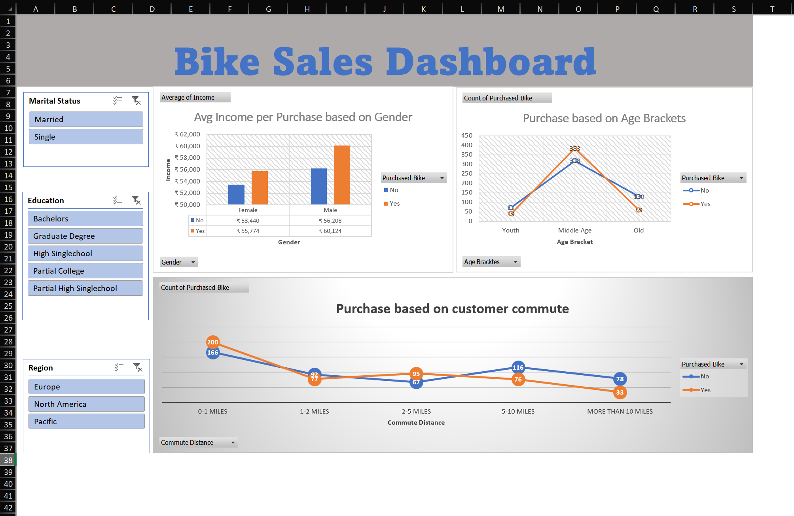

# Bike Sales Dashboard - Excel

## Project Overview

This project analyzes customer demographics and purchasing behavior using Microsoft Excel. The dashboard provides insights into how factors such as income, age, commute distance, education, and marital status influence bike purchases.

## Dataset

The dataset contains customer information including:

- Marital Status
- Gender
- Income
- Children
- Education
- Occupation
- Home Ownership
- Cars
- Commute Distance
- Region
- Age
- Purchased Bike

## Data Cleaning

The following preprocessing steps were performed:

- Removed duplicate records
- Standardized categorical values
- Formatted income values
- Created Age Brackets (Youth, Middle Age, Old)
- Prepared data for analysis using Pivot Tables

## Dashboard Features

### Average Income by Gender and Purchase Status
Analyzes income differences between customers who purchased bikes and those who did not.

### Purchase Analysis by Age Bracket
Compares bike purchase behavior across different age groups.

### Purchase Analysis by Commute Distance
Shows how commuting distance influences purchasing decisions.

### Interactive Filters
- Marital Status
- Education
- Region

## Tools Used

- Microsoft Excel
- Pivot Tables
- Pivot Charts
- Slicers
- Data Cleaning
- Data Analysis
- Dashboard Design

## Project Screenshots

### 1. Raw Dataset

---

### 2. Data Cleaning & Transformation

---

### 3. Pivot Table Analysis

---

### 4. Final Interactive Dashboard

---

## Key Insights

- Customers with higher income are more likely to purchase bikes.
- Middle-aged customers account for the highest number of purchases.
- Short-distance commuters show stronger bike purchase behavior.